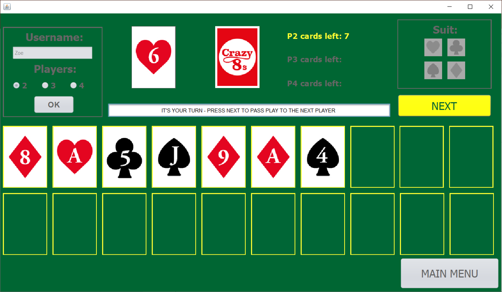
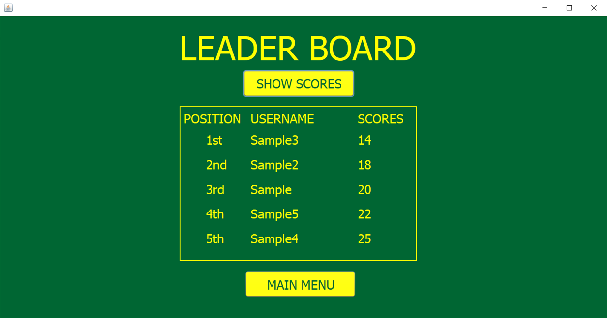

# Crazy Eights

### About
This is a recreation of the crazy eights card game, written in Java using jFrames. It allows the user to play against between 1 and 3 computerised players and have their highest scores ranked in a leader board. The aim of the game is to be the first player to have no cards left in their hand by placing down cards that match the one on top of the pile in either number or suit. Wildcards are also implemented to make the game more interesting and strategic.  
**Please note: There are full instructions that refer to my specific version of the game on the main menu of the game. I would highly recommend reading this in full before beginning as there are a few differences between this version of the game and the way that crazy eights is typically played.**

### Motivation
This project was created for my A-Level Computer Science coursework. This was created over the course of a few months along with extensive development logs & documentation. I had only just began learning Java before creating this project and I decided, along with my teacher, that creating my coursework in Java would be a great way to learn the language and quickly pick up knowledge and skills along the way. Whilst I do not think Java was the best choice for creating a game as it introduced many limitations and difficulties as this is not its typical use, it allowed me to create a working and effective project to be assessed and allowed me to better get to grips with the language. 

### Screenshots
**Main game view:**

**Leader board view:**

### API used
-	Java Swing (https://docs.oracle.com/javase/tutorial/uiswing/components/index.html)

### Installation
In order for the application to run on your machine the following software must also be installed:
-	Java (https://java.com/en/download/)
-	Java Development Kit (JDK) (https://www.oracle.com/uk/java/technologies/javase-downloads.html)   
Please download and extract all the files from the repository and then launch CrazyEights.jar to open the games main menu.

### Status
Although the game is fully playable in its current state, I would like to add the reverse direction functionality to a future version of the game as well as removing the need to click the next button between each players turn to give a smoother, less cluttered experience.
